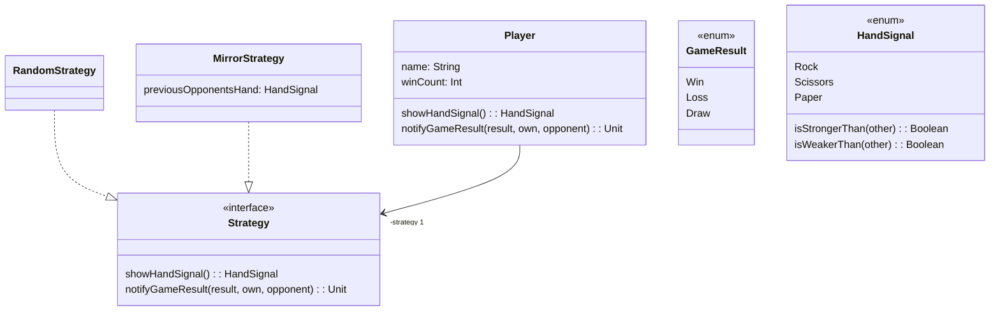

# Exercise #12 - UML, SO(LID)

## 0. Organization

1. Is there anything your tutor wants to tell you about previous homework?
2. Do you have any homework-related questions?
3. Have you accepted Homework #12 already? Do you know that it's the last homework?
4. What do you know about the Teamprojekt? What knowledge do you think you'll need from other courses?

## 1. UML

_The code for this task goes into the folder `game`._

Revisit the lecture slides on UML. Try to briefly recap the following concepts with your neighbour:

### Objects and classes in UML 

1. How are they drawn?
2. What is the relationship between objects and classes?
 
### Relations between classes in UML

1. What are the different kinds of relations?
2. How do they differ?
3. How are they drawn?
 
<details>
 


</details>

### From UML to Code

Let us assume the following diagram in UML:



Try to answer the following questions:
1. What business logic (of what program) does this diagram describe?
2. What are the classes in this diagram?
3. What are the relations between the classes in this diagram?

Then convert the design of the diagram into Scala (you can use the `Game.scala` file in this repository).
Be aware that there are multiple valid implementations of the same diagram.

**You do not need to implement the game fully.**

Don't actually implement the methods -- first just write signatures and use Scala's `???` (like `...` in Racket) to crash the program if a method is executed.


## 2. Requirements Analysis and User Stories

Your Teamprojekt is to implement a new forum-like system for Software Engineering.
One of your team members defines the following User Story:

> 1. **As a** professor,
> 2. **I want** to post announcements
> 3. **so that** they appear on my students' feed where they can read them.

### Part 1

You are implementing this User Story.
What classes will be in your "model" (for example a UML class diagram?) 
_Only name the classes._

<details>
Professor, Announcement, and Student, Feed can be possible model classes.
</details>

### Part 2

Come up with two more requirements in the form of a User Story:

> 1. **As a** `user role concerned by the story`,
> 2. **I want** `goal of the story`,
> 3. **so that** `reason for the story`.

## 3. Revise SO(LID)

**SOLID**
- **S**ingle Responsibility Principle: _A component (class, function, module, ...) should only have one reason to change._
- **O**pen–Closed Principle: _A component should be open for extension, but closed for modifications._

<details><summary>(next week)</summary>

- **L**iskov Substitution Principle: _Subtypes must be behaviorally substitutable for their base types._
- **I**nterface Segregation Principle: _Clients should not be forced to depend upon interfaces that they do not use._
- **D**ependency Inversion Principle: _High-level modules should not depend on low-level modules. Both should depend upon abstractions [not concretions]._

</details>

## 3. SO(LID)

### Part 1a: Single Responsibility Principle

Consider the following code:

```scala
class User(
  var name: String, 
  var email: String, 
  var password: String
) {
  def validateEmail(): Boolean = 
    email.contains("@") && email.contains(".")
  
  def sendPasswordResetEmail(): Unit = {
    // Directly handles email sending logic
    println(s"Sending password reset to $email")
  }
  
  def encryptPassword(): String = {
    password.reverse // Bad encryption example
  }
}
```

What are possible reasons for it to change?

<details>

For example:
- change the email validation to also check for bogus/single-use domains
- change password storage to use a proper hashing algorithm
- change how we send email (e.g. via external provider, directly, ...)
- ...

</details>

### Part 2a: Open-Closed Principle

Consider the following code:

```scala
import java.io._
def storePassword(user: String, pw: String) = {
  val hashedPw = myHash(pw)
  val pwFile = new PrintWriter(new File("passwd"))
  pwFile.write(user)
  pwFile.write(':')
  pwFile.write(hashedPw)
  pwFile.close()
}
```

Which extensions are most likely?
How would you change the code, so it is open for extension?

<details>

Potential extensions / code changes:
- Multiple or different password file
  - e.g. pass password storage interface
- Different password hashing algorithms or salting
  - e.g. pass hash function (or interface)
- ...

</details>

### Part 3: SO(LID)

Consider the following code; assume all methods are implemented (although they aren't here).

```scala
class Display {
  def drawCircle(position: Point, radius: Int): Unit = {
    // code that draws a circle onto the screen in the current window
  }
  def drawLine(from: Point, to: Point): Unit = {
    // code that draws a circle onto the screen in the current window
  }
  def setCurrentWindow(id: Int) = {
    // code to set the current window
  }
  def openWindow(): Int = {
    // code to open a new window, returns id
  }
}
```

Does it fulfill the SRP and OCP?
Why (not)? Seen from which perspective?

<details>

SRP:
- does multiple things:
  - window management
  - handling drawing

OCP:
- how could we
  - add a new shape to draw, without changing the code
  - change to a single-page WebApp (no windows in this sense!)
  - ...

</details>